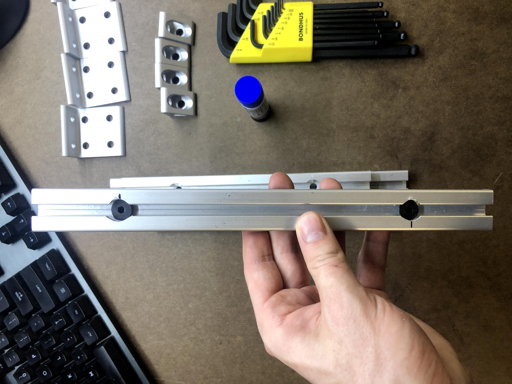
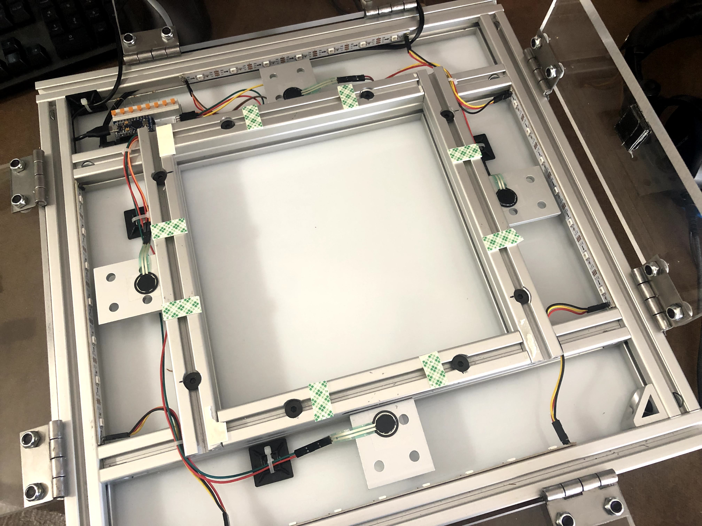
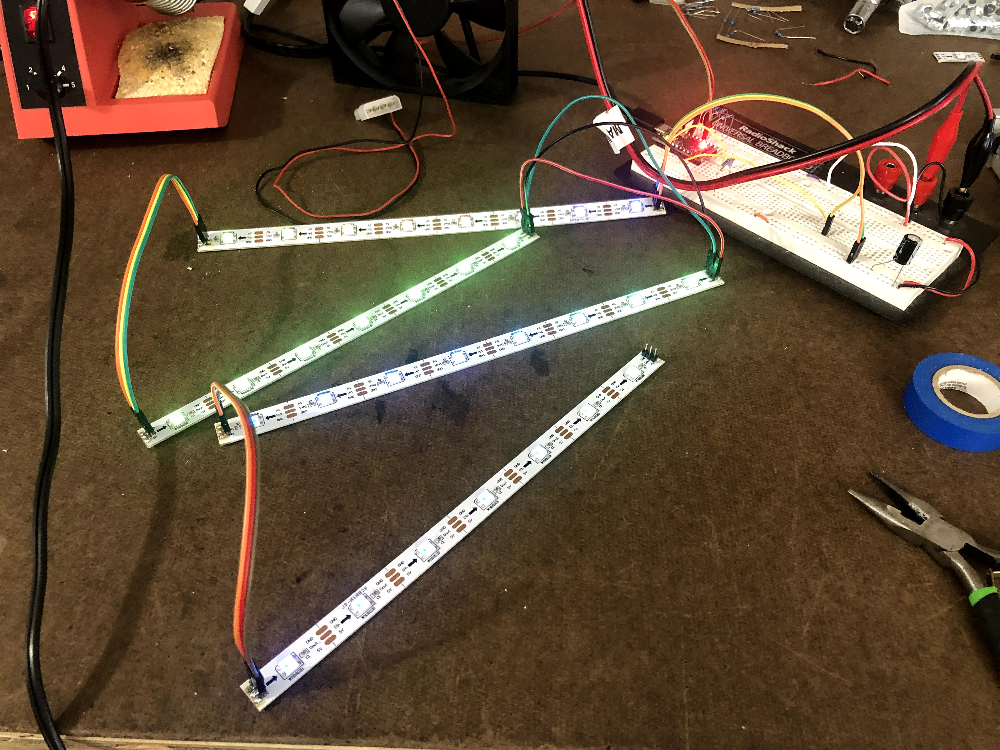

Metal Travel Pad

This project is a metal travel pad used for DDR (Dance Dance Revolution) or ITG (In the Groove). It features aluminum construction, four acrylic panels, force-sensitive-resistor sensors, a custom PCB for I/O, and configurable addressable LED strips. This pad was built using items purchased online and fabricated using simple hand tools. Total cost is hard to estimate, as I had a lot of tools and parts lying around from other projects, but with shipping and tax I estimate I probably spent about $250-$300.

# Pad Description

The metal travel pad comprises mechanical and electrical components, as well as software running on the PC and microcontroller.

## Mechanical Components

The pad frame consists of 1"x1" T-slot extruded aluminum arranged in a 17.5"x17.5" footprint. Interior rails form the mounting surface for the internal FSR brackets and the center panel, which is mounted on "low profile" 1"x0.5" extrusions. All components are retained with standard T-slot fasteners. Each panel is mounted via two hinges, which allow the panels to be easily flipped up for pad modding or cleaning.

The panels are 3/8" acrylic measuring 3" wide and 11" long. Enabling a flat upper surface, 1/4"-20 flathead screws retain each panel to its respective hinges. Low-profile lock washers secure the screws in place. 

The center panel is a standard DDR center panel and is retained using double-sided mounting tape. The extrusion also provides screws as an alternative mounting option. Slippery plastic such as UHMWPE may be substituted for this center panel, although such parts may be cheaper to source locally.

## Electrical Components

This pad features a custom printed circuit board (PCB). The PCB holds an Arduino Pro Micro, which features the ATMega32u4 chipset and breaks-out many I/O pins. The ATMega32u4 features a native USB interface and is supported by the Arduino IDE. The microcontroller acts like a joystick or keyboard, which permits modern Dance Game engines (Stepmania being the most prevalent) to interpret it as an input device.

The PCB is a very simple two-layer board with a few key features:

1. Spring-loaded, push-to-disconnect terminal blocks for the current divider fixed resistors. This is a tool-free way for the user to adjust the FSR sensitivity range without needing to de-solder or worry about the resistors falling out on their own. 
2. Male header pins for dupont-style FSR terminals, connected in four current dividers to the swappable fixed resistors and analog pins A0-A3
3. Male header pins for WS2812 addressable LED strips and voltage-smoothing capacitor. Data pin is connected to the Microcontroller pin 6
4. A 5V barrel power jack for lights power, isolated from the microcontroller power. Also includes through-holes for the option of a 5V screw terminal
5. Four SMD LEDs that reflect whether the analog threshold has been reached, regardless of whether the main lights have power (useful if you don't want to pull up Test Input in Stepmania and don't have the lights plugged in)
6. Two mounting holes
7. A reset button

The lights are WS2812 addressable LED light strips. Each strip is daisy-chained off the last and requires no external circuitry besides what is present in the PCB. 

## Software

The pad uses [teejusb's outstanding FSR software](https://github.com/teejusb/fsr), which supports the PCB LEDs, several different microcontrollers, and includes a slick web interface for visualizing and adjust the FSR thresholds. My pad specifically uses a (slightly modified) [dom-fastled-lights branch](https://github.com/dominickp/fsr/tree/dom-fastled-lights) of Dominick's fork, with extends the code to support the panel lights and also includes a web frontend to modify the light colors. 

# Building Instructions

Here, I'll describe the steps that I followed to design and build this pad.

## Bill of Materials

This first table describes the components I mailordered specifically for this project and where I obtained them. **Note that I took advantage of Digikey's price breaks for higher order quantities and this table does not reflect these costs at single-quantity**

| Category       | Part                                           | Vendor        | Vendor Part#        | Detail                                          | Quantity | Cost/Ea [USD] |
| -------------- | ---------------------------------------------- | ------------- | ------------------- | ----------------------------------------------- | -------- | ------------- |
| Pad Frame      | Front Rail / Rear Rail (17.5")                 | TNUTZ         | EX-1010             | NO MACHINING                                    | 2        | 3.90          |
| Pad Frame      | Side Rail / Inside Rail (15.5")                | TNUTZ         | EX-1010             | Ø9/16" COUNTERBORE @ "A" (both ends)            | 4        | 5             |
| Pad Frame      | Inside Interior Rail (8.75")                   | TNUTZ         | EX-1010             | Ø9/16" COUNTERBORE @ "A" (both ends)            | 2        | 3.60          |
| Pad Frame      | Interior Top Rail (10.75")                     | TNUTZ         | EX-1050             | NO MACHINING                                    | 2        | 1.46          |
| Pad Frame      | Inside Interior Top Rail (8.75")               | TNUTZ         | EX-1050             | NO MACHINING                                    | 2        | 1.70          |
| Pad Frame      | 10 Series Single Anchor Fastener Assembly      | TNUTZ         | AF-010              |                                                 | 14       | 1.40          |
| Pad Frame      | 10 Series 1/4-20 Economy T-Nut & 1/2" lg screw | TNUTZ         | COMBO-010-A         |                                                 | 40       | 0.19          |
| Pad Frame      | 10 Series 2 Hole Inside Corner Gusset          | TNUTZ         | CB-010-A            |                                                 | 4        | 1.95          |
| Pad Frame      | 10 Series 6 Hole Inside Corner Bracket         | TNUTZ         | CB-010-F            |                                                 | 4        | 2.25          |
| Pad Sensor     | FSR                                            | Interlink     | FSR X 402           | Female contacts and housing                     | 4        | 3.49          |
| Panel Mount    | Panel Hinge                                    | McMaster-Carr | 1514A11             |                                                 | 8        | 0.75          |
| Panel Mount    | Flathead Screw                                 | McMaster-Carr | 93791A552           | 1/4"-20 x 5/8" (pack of 25)                     | 1        | 5.53          |
| Panel Mount    | Acrylic Panel                                  | McMaster-Carr | 1227T359            | 3" Wide x 3.8" Thick, 4' Long                   | 1        | 19.36         |
| Panel Mount    | Panel Nut                                      | McMaster-Carr | 90566A029           | 1/4"-20 Nylon-insert, low-profile (pack of 100) | 1        | 4.08          |
| PCB Components | Fixed Resistor Terminal                        | Digikey       | 732-11090-ND        | Würth Elektronik / 691411410008                 | 1        | 2.93          |
| PCB Components | PCB LED Resistor                               | Digikey       | P123823CT-ND        | 0805 package, 220 Ohm                           | 4        | 0.094         |
| PCB Components | FSR Male Header                                | Digikey       | 2057-PH2RA-08-UA-ND | 8-position, 90-degree                           | 1        | 0.24          |
| PCB Components | Lights Male Header                             | Digikey       | 2057-PH1RB-03-UA-ND | 3-position, 90-degree                           | 1        | 0.11          |
| PCB Components | Fixed Resistor                                 | Digikey       | CF18JT1K00CT-ND     | 1k Ohm (swappable)                              | 4        | 0.0248        |
| PCB Components | LED Data Resistor                              | Digikey       | YAG3733CT-ND        | 0805 package, 470 Ohm                           | 1        | 0.050         |
| Pad Light      | LED Bars                                       | Ebay          |                     | WS2812B, 1m. Optional                           | 1        | 9.99          |

In addition, you'll want the following components. I had these laying around already or got them separately. Different people may be able to source these at different costs so I've removed the "cost" column here. I personally acquired most of these items through Amazon.com or Ebay.com for different projects. I'd **strongly encourage you to check polarities and package sizes on all electronic components.**

| Category            | Part                               | Suggested Vendor                                             | Detail                                                       | Quantity                     |
| ------------------- | ---------------------------------- | ------------------------------------------------------------ | ------------------------------------------------------------ | ---------------------------- |
| Pad Frame           | Center Panel                       | McMaster-Carr, local plastics supplier, your DDR/ITG arcade pad | Approx 11"x11"                                               | 1                            |
| Pad Frame           | Base Panel                         | McMaster-Carr, local plastics supplier                       | Approx 17.5"x17.5". Not necessary if you mount the PCB elsewhere | 1                            |
| Pad Frame           | Center Panel Fastener              | Local hardware store                                         | I used 3M mounting tape. Screws should work too!             |                              |
| Pad Frame           | Hinge-to-rail screws               | Local hardware store                                         | I used button-heads but you could use other varieties        | 16                           |
| Pad Sensor          | Wire                               | Local electronics supplier                                   | Various colors are helpful. I used 22 AWG                    | Several feet                 |
| Pad Sensor, Lights  | Double-Sided Tape                  | Local supplier                                               | I used standard Scotch                                       |                              |
| Pad Sensor / Lights | DuPont-style crimps                | Local electronics supplier                                   | I used both female and male pins/housings                    | 8 per FSR, 6 per panel light |
| Lights              | 3-across Male headers              | Local electronics supplier, Digikey.com                      | I bent straight headers but 90 degree headers would be prefferable | 7                            |
| Lights              | Lights power supply                | Local electronics supplier                                   | 5V, I used 31 LEDs that pulled about about 770ma peak        | 1                            |
| PCB                 | Electronics base                   | JLCPCB.com, ALLPCB.com, Oshpark.com                          | ALLPCB fabricated mine for free.                             | 1                            |
| PCB Components      | Lights power barrel jack           | Digikey.com                                                  | Make sure to check your polarity :)                          | 1                            |
| PCB Components      | Microcontroller Pro Micro          | Sparkfun.com                                                 | I use a 5V Arduino, not sure if the 3.3v works               | 1                            |
| PCB Components      | Lights voltage-smoothing capacitor | Digikey.com                                                  | The PCB is designed for a through-hole electrolytic cap, I used 470uF | 1                            |
| PCB Components      | PCB LEDs                           | Digikey.com                                                  | 0805 package. Note these are optional                        | 4                            |
| PCB Components      | Reset switch                       | Digikey.com                                                  | I used a omron-style tactile switch                          | 1                            |
| Modding             | Gorilla Tape                       | Local supplier                                               | Replace with your preferred mod tape                         |                              |
| Cable Management    | Zip Tie mounts                     | Local supplier                                               | I used these to hold the wires down                          |                              |
| Communication       | Micro USB cable                    | Local supplier                                               | Connects directly to the Pro Micro                           |                              |
|                     |                                    |                                                              |                                                              |                              |

In addition, I'd recommend the following tools. Several of these I bought for other projects and several I borrowed from my local tool-share.

| Tool                             | Purpose(s)                                                   |
| -------------------------------- | ------------------------------------------------------------ |
| Power drill / Drill Press + Bits | Drill-out clearance holes on hinges and top rails, create countersinks in panels |
| DuPont-style crimper             | Crimp FSR and LED cables                                     |
| Soldering iron                   | Solder through-hole components                               |
| Reflow station                   | Solder surface-mount components                              |
| Hand Saw                         | Cut acrylic panels to length                                 |
| Ball-ended allen keys            | Assemble frame                                               |
| Threadlocker                     | Secure fasteners                                             |
| Ratchet / Wrenches               | Secure fasteners                                             |
| Exacto Knife / Deburring tool    | Clean up aluminum                                            |
| Tweezers                         | Position SMD components                                      |
| Flux                             | SMD soldering                                                |
| Wire stripper                    | Prepare FSR and lights wire                                  |
|                                  |                                                              |

## Assembly Instructions

### Hardware Components

1. De-burr all the T-Slot extrusion. I used an Exacto knife but a deburring tool is the right tool for the job.

2. Use the anchor fastener assemblies to fasten the inside interior rails to the interior rails. Make sure to include two t-nuts for each of the FSR brackets in the future. Also include two t-nuts on each of four rails for the top rails in the future. 

3. Use anchor fasteners to fasten the interior rails to the side rails. Install the corner gussets (I removed one gusset to leave more clearance for the PCB). You may also want to install extra t-nuts to retain the base panel. Make sure you include two t-nuts on the side rail outsides for each of the panel hinges in the future.

4. Install the front/back rails. I personally applied threadlocker after checking all the alignments but you can do it as you go.

5. Prepare the interior top rails and the inside interior top rails. Since I used used flat-head screws to retain the top rails, I had to drill a 1/4"-20 clearance hole in the center and a screwhead clearance hole through the faces. Secure these in place to the previously-installed t-nuts. 

6. Drill and countersink clearance holes in the acrylic panels. I'd recommend using your hinges as a guide.

7. The stock holes on the hinges are slightly too small for a 1/4"-20 clearance, so drill those out using a 1/4" clearance bit. I'd also recommend removing the burrs at this step.

8. Install the hinges to the panels and the assemblies to the outer surface of the side and front/back rails.

9. Prep and secure the base plate (if desired) 

10. I'd do this last, but also prepare and secure the center panel. You can screw into t-nuts located in the top rails, or use double-sided tape like me. 

    

    

### Electronic Components

#### PCB Assembly

I like to hand-solder PCB components but if you like the stencil-solderpaste-reflowoven method, go for it!

1. Tape the board down to a bench. Using flux, solder the SMD current-limiting LED resistors. I used 220 ohm.
2. Solder the SMD LEDs (I used blue). Solder the LED signal resistor. I used 470 ohm. 
3. Solder the TH components (FSR header, lights header, capacitor, reset switch, barrel jack) 
4. Solder the Pro Micro sockets and the swappable PCB terminals. I do these last since they are plastic and can be melted by the reflow station.
5. Install the microcontroller and fixed current-divider resistors. 

#### Lights Preparation

1. Cut the LED strips as desired. I used 7 LEDs for left and right, 7 LEDs for up, and 8 LEDs for down.
2. Solder 3-wide male headers to the LED strips. 
3. Prepare your daisy-chain wires. **Please ensure that you don't cross-over the power and data pins! I've heard WS2812B has reverse polarity protection but I can confirm crossing-over the data and power pin will kill at least one LED ;)** 
4. I'd highly recommend testing out the LEDs on a bench before installing them to confirm the integrity of your joints and crimps. 

#### Final Assembly

1. Secure the PCB to the baseplate or a rail if desired. Prepare and plug the FSR cables into the male headers, as well as the first leg in the lights daisy-chain. I installed my PCB on the far-left hand up arrow cavity. 
2. Attach the FSRs to the brackets using double-sided tape. Attach the lights to the inside of the top/bottom and side rails using double-sided tape. Mod the FSRs as desired using double-sided tape. I also used a few zip tie mounts to handle the wires. 

## Software Instructions

As I didn't write the vast majority of the code, I'll point you first to [teejusb's FSR software](https://github.com/teejusb/fsr), and next to the [dom-fastled-lights branch](https://github.com/dominickp/fsr/tree/dom-fastled-lights) of Dominick's fork. I made a couple small modifications to get Dom's light setup to work with four-panel.
